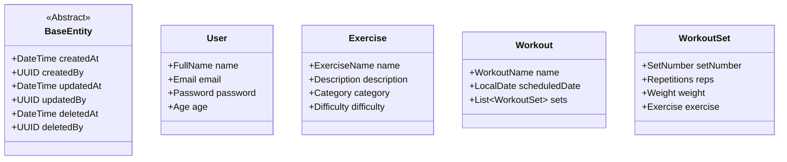

# Gym Tracker Domain Model & Rules

## 1. System Architecture (UML)

```mermaid
classDiagram
    class BaseEntity {
        <<Abstract>>
        +DateTime createdAt
        +UUID createdBy
        +DateTime updatedAt
        +UUID updatedBy
        +DateTime deletedAt
        +UUID deletedBy
    }
   class User {
        +FullName name
        +Email email
        +Password password
        +Age age
    }
    class Exercise {
        +ExerciseName name
        +Description description
        +Category category
        +Difficulty difficulty
    }
    class Workout {
        +WorkoutName name
        +LocalDate scheduledDate
        +List~WorkoutSet~ sets
    }
    class WorkoutSet {
        +SetNumber setNumber
        +Repetitions reps
        +Weight weight
        +Exercise exercise
    }
```
